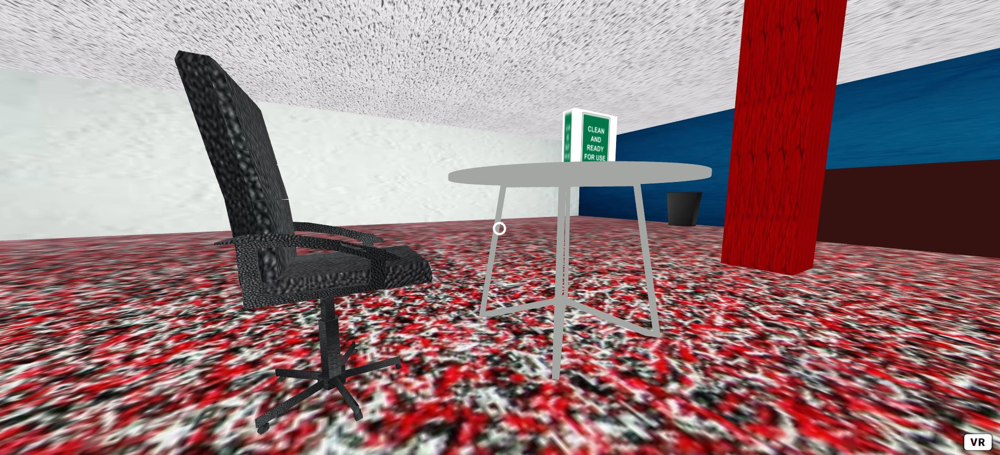
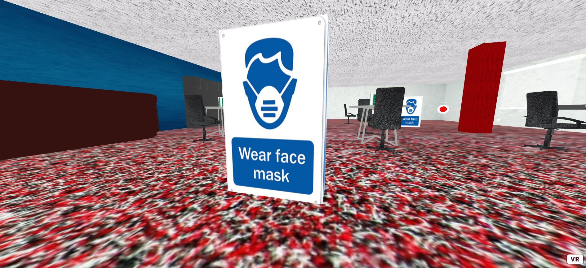
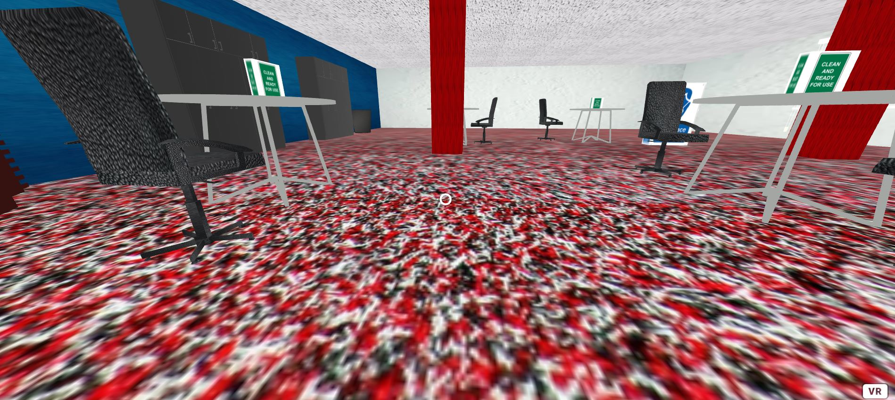
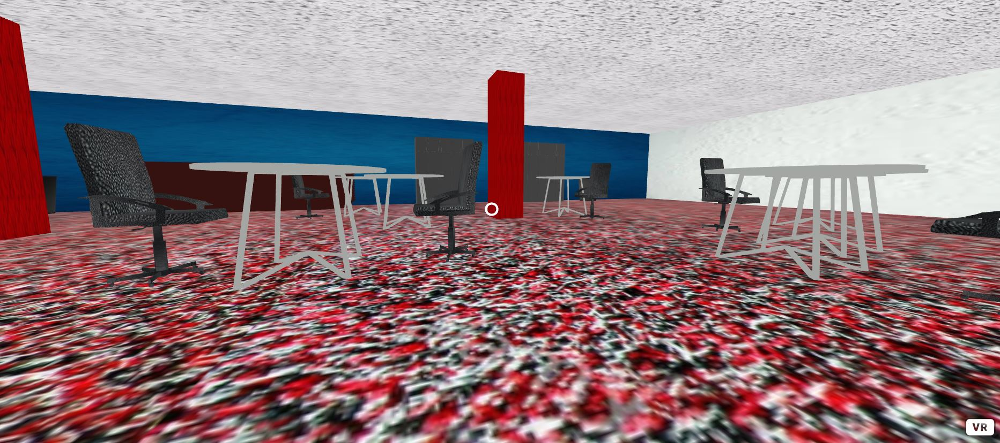

# VRProject1
 VR 2020 Project 1

My project is a study room in the SUB (Student Union Building) and shows the differences that have been made to protect against the spread of COVID-19.

Demo Link: https://jordan-cockrell.github.io/VRProject1/

Clean Table Cards

First is the Clean Table sign that has been added since COVID-19, which was put up on each table after they have been cleaned so new students know which tables are safe to use.

Wear Mask Signs

The second difference are the giant wear mask signs spread across the SUB to remind students to wear their masks when in the building.

Socially Distanced Disks

All desks are socially distanced!

Pre-COVID SUB

Before COVID, there were no signs and less socially distanced desks.
